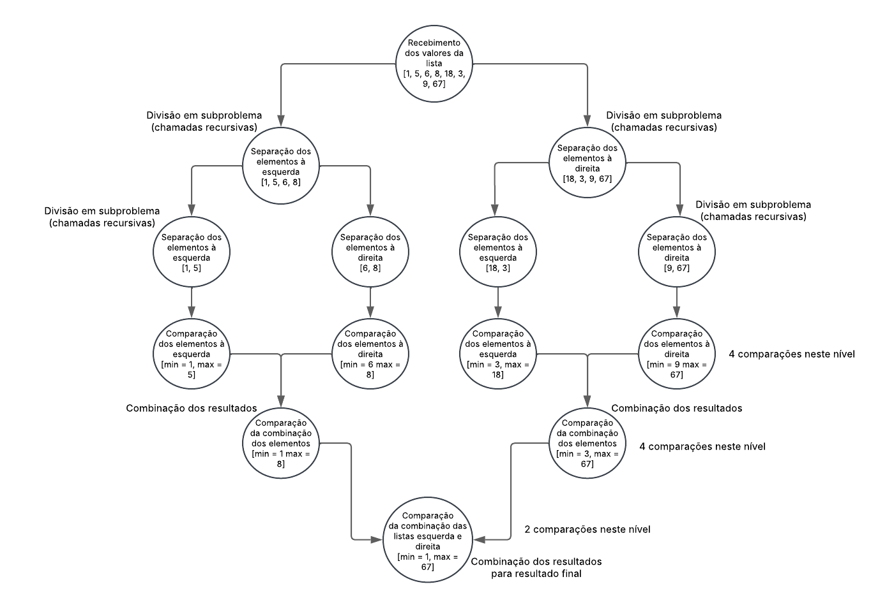

# Implementação do Algoritmo de Seleção Simultânea do Maior e do Menor Elementos (MaxMin Select) em Python

O algoritmo de seleção simultânea (MaxMin Select) pode ser implementado de forma recursiva, utilizando a técnica de divisão e conquista. O problema é dividido em subproblemas menores que são resolvidos recursivamente, e seus resultados são combinados para encontrar o maior e o menor elementos com eficiência. Esse método reduz o número de comparações necessárias em comparação com uma abordagem ingênua.

## Implementação do Algoritmo

A implementação inicia-se com a declaração da função recursiva principal do algoritmo MaxMin Select.

```python
   def maxmin(lista):
```

A partir disso, há uma verificação de tamanho da lista. Caso o tamanho da lista for 1, significa que há apenas um valor presente, portanto este é o maior e o menor número.

```python
    if len(lista) == 1:
        result = [lista[0], lista[0]]
        return result
```

Logo após, há outra verificação de tamanho da lista. Dessa vez, se o tamanho for 2, os valores são diretamente comparados para identificar um mínimo e um máximo.

```python
    if len(lista) == 2:
        if lista[0] > lista[1]:
            result = [lista[1], lista[0]]
            return result
        else:
            result = [lista[0], lista[1]]
            return result
```

A próxima etapa divide a lista em duas sublistas para realizar a estratégia de divisão e conquista.

```python
    meio = len(lista)//2
    esquerda = lista[:meio]
    direita = lista[meio:]
```

Assim, há uma recursão para que a lista continue diminuindo até que encaixe em alguma das condições dos _ifs_ mencionados anteriormente.

```python
    min_esq, max_esq = maxmin(esquerda)
    min_dir, max_dir = maxmin(direita)
```

Então, há uma comparação entre os mínimos encontrados (os mínimos de cada sublista) e os máximos encontrados (os máximos de cada sublista).

```python
    min_total = min(min_esq, min_dir)
    max_total = max(max_esq, max_dir)
```

Finalmente, como boa prática, é criada a variável _result_ que contém um _array_ de apenas dois objetos: o mínimo e o máximo. O retorno da função é essa variável.

```python
    result = [min_total, max_total]
    return result
```

## Como rodar em ambiente local?

### Passo 1: Clonar o repositório

1. Clone o repositório git em uma pasta no seu ambiente local com o seguinte comando:

   ```bash
   git clone https://github.com/pauladefreitas/TI2-FPAA.git
   cd TI2-FPAA
   ```

### Passo 2: Executar o script

1. Execute o script principal:

   ```bash
   python main.py
   ```

2. O programa solicitará que você insira números e quando quiser terminar a lista, digite FIM, como:

   ```bash
   Digite os números da sua lista. Para parar, digite FIM.
   ```

3. O resultado será exibido logo depois.

## Relatório técnico

### Análise da complexidade assintótica pela contagem de operações

A análise de complexidade assintótica pela contagem de operações é uma forma de estimar o crescimento do tempo de execução de um algoritmo com base no número de operações executadas.

O algoritmo se inicia verificando se o tamanho da lista é maior que 1, se for o caso, não há comparações.

```python
    if len(lista) == 1:
        result = [lista[0], lista[0]] #+0
        return result
```

Posteriormente, há outra verificação do tamanho da lista, dessa vez por 2, se for o caso, ocorre a primeira comparação do maior e menor valor entre os dois.

```python
    if len(lista) == 2:
        if lista[0] > lista[1]: #+1
            result = [lista[1], lista[0]]
            return result
        else:
            result = [lista[0], lista[1]]
            return result
```

Agora, há um processo de divisão em um subproblema. A lista maior é divida em duas listas menores, a fim de diminuir a complexidade do algoritmo pela metade.

```python
    meio = len(lista)//2
    esquerda = lista[:meio] #n/2
    direita = lista[meio:]  #n/2
```

Por fim, temos as duas últimas comparações, que comparam os valores das listas restantes para achar os valores mínimos e máximos de cada uma.

```python
    min_total = min(min_esq, min_dir) #+1
    max_total = max(max_esq, max_dir) #+1
```

Com isso, a análise para \(C(n)\) sendo \(C\) = contagem de comparações e \(n\) = número de elementos.

$$
C(1) = 0
$$

$$
C(2) = 1
$$

$$
C(n) = 2C(n/2) + 2
$$

Resolvendo a recorrência:

$$
C(n) = 2C(n/2) + 2
$$

$$
C(n) = 2(2C(n/4) + 2) + 2
$$

$$
C(n) = 4C(n/4) + 4 + 2
$$

$$
C(n) = 4C(n/4) + 6
$$

$$
C(n) = 4(2C(n/2) + 2) + 6
$$

$$
C(n) = 8C(n/8) + 8 + 6
$$

$$
C(n) = 8C(n/8) + 14
$$

A partir disso, vemos o padrão:

$$
C(n) = 2^kC(n/2^k) + 2k
$$

Para encontrar o valor de \( k \), recorremos ao caso base onde a recursão para quando chega-se ao caso base \( C(2) = 1 \):

$$
\frac{n}{2^k} = 2
$$

$$
n = 2^{k+1}
$$

$$
k = \log_2 n - 1
$$

Na fórmula:

$$
C(n) = 2^{\log_2 n} - 2 \cdot 1 + 2(\log_2 n - 1)
$$

$$
C(n) = \frac{n}{2} + 2\log_2 n - 2
$$

$$
C(n) \sim \frac{3n}{2} - 2
$$

Como, nesta operação, ignora-se as constantes, dá-se que a complexidade temporal é \(O(n)\).

### Análise da complexidade assintótica pela aplicação do Teorema Mestre

Dado que a recorrência do algoritmo MaxMin Select é:

$$
T(n) = 2T (n/2) + O(1)
$$

1. Os valores de _a_, _b_ e _f(n)_ na fórmula são:

$$
a = 2
$$

$$
b = 2
$$

$$
f(n) = O(1)
$$

2. Cálculo para determinar o valor de _p_:

$$
p = \log_b a
$$

$$
p = \log_2 2
$$

$$
p = 1
$$

3. Em qual dos três casos do Teorema Mestre essa recorrência se enquadra:

MaxMin Select se enquandra no Caso 1, onde o custo da recursão domina, porque a maior parte do trabalho está na resolução dos subproblemas. Um exemplo é quando o custo externo é muito pequeno.

Visto que p = 1, e como:

$$
f(n) = O(n^1-E) = O(n^0)
$$

$$
S = T(n) = Θ(n)
$$

4. Solução assintótica:

$$
f(n) = O(1), e n^p = n
$$

$$
T(n) = Θ(n)
$$

O que significa que o algoritmo cresce linearmente com o tamanho da entrada _n_.

### Diagrama visual



obs: para visualizar as observações escritas no diagrama, o GitHub deve estar no modo claro.
